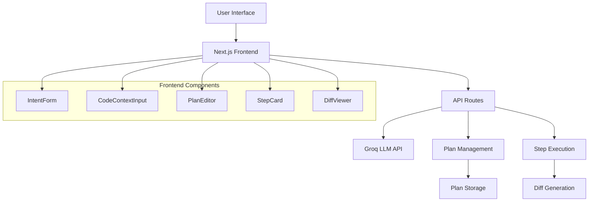

# Design Document

## Overview

The Coding Agent Planner is a Next.js web application that serves as an intelligent intermediary between developers and coding agents. It transforms high-level user requests into structured, executable plans and generates code changes through LLM integration. The application follows a three-phase workflow: plan generation, plan editing, and step execution with diff review.

The system leverages the existing Next.js 15 setup with React 19, TypeScript, and Tailwind CSS. It integrates with the Groq API for LLM capabilities and provides a responsive, interactive interface for managing coding tasks.

## Architecture

### High-Level Architecture



### System Flow

1. **Input Phase**: User provides code context and intent through form components
2. **Plan Generation**: API route processes inputs and calls Groq API with structured prompts
3. **Plan Editing**: Interactive UI allows step modification, reordering, and customization
4. **Step Execution**: Individual steps are executed via API, generating code diffs
5. **Review & Export**: Users review changes and export final patches

## Components and Interfaces

### Frontend Components

#### IntentForm Component
```typescript
interface IntentFormProps {
  onSubmit: (data: { codeContext: string; intent: string }) => void;
  loading: boolean;
}
```
- Handles user input for code context and intent
- Validates required fields
- Manages form state and submission

#### CodeContextInput Component
```typescript
interface CodeContextInputProps {
  value: string;
  onChange: (value: string) => void;
  placeholder?: string;
}
```
- Provides syntax-highlighted code input
- Supports multiple programming languages
- Auto-detects language from content

#### PlanEditor Component
```typescript
interface PlanEditorProps {
  plan: Plan;
  onPlanChange: (plan: Plan) => void;
  onExecuteStep: (stepId: string) => void;
}
```
- Displays plan steps as editable cards
- Implements drag-and-drop reordering
- Manages step CRUD operations

#### StepCard Component
```typescript
interface StepCardProps {
  step: Step;
  onEdit: (step: Step) => void;
  onDelete: (stepId: string) => void;
  onExecute: (stepId: string) => void;
  executionResult?: StepExecution;
}
```
- Renders individual plan steps
- Provides inline editing capabilities
- Shows execution status and results

#### DiffViewer Component
```typescript
interface DiffViewerProps {
  diff: string;
  format: 'unified_diff' | 'full_file';
  language?: string;
  onAccept: () => void;
  onCopy: () => void;
  onRegenerate: () => void;
}
```
- Displays code diffs with syntax highlighting
- Supports unified diff and full file formats
- Provides action buttons for user interaction

### API Routes

#### /api/generate-plan
- **Method**: POST
- **Input**: `{ codeContext: string, intent: string }`
- **Output**: `Plan`
- **Purpose**: Generates structured plan from user input

#### /api/execute-step
- **Method**: POST
- **Input**: `{ step: Step, codeContext: string }`
- **Output**: `StepExecution`
- **Purpose**: Executes individual plan step and returns code changes

## Data Models

### Core Types

```typescript
interface Plan {
  task: string;
  language?: string;
  file?: string;
  steps: Step[];
}

interface Step {
  id: string;
  title: string;
  description: string;
  input_files?: string[];
  output?: {
    type: "instruction" | "patch" | "file_replace";
    patch_format?: string;
  };
}

interface StepExecution {
  step_id: string;
  suggested_patch: {
    format: "unified_diff" | "full_file";
    diff: string;
  };
  explanation: string;
}
```

### State Management

The application uses React's built-in state management with the following structure:

```typescript
interface AppState {
  currentPlan: Plan | null;
  stepExecutions: Map<string, StepExecution>;
  loading: boolean;
  error: string | null;
}
```

## LLM Integration

### Groq API Configuration

```typescript
interface GroqConfig {
  apiKey: string;
  model: string;
  maxTokens: number;
  temperature: number;
}
```

### Prompt Templates

#### Plan Generation Prompt
```
SYSTEM: You are a developer assistant. Output only valid JSON that conforms to the Plan schema below.

SCHEMA: {
  "task": "<short summary>",
  "language": "<language>",
  "file": "<primary file>",
  "steps": [{
    "id": "<id>",
    "title": "<short title>",
    "description": "<detailed description of change>",
    "input_files": ["..."],
    "output": {
      "type": "patch"|"instruction"|"file_replace",
      "patch_format": "unified_diff"
    }
  }]
}

USER: Here is the user intent: <<<USER_INTENT>>>
Here is the code context (may be empty): <<<CODE_CONTEXT>>>

INSTRUCTIONS:
- Break the user's intent into a sequence of actionable steps
- Keep steps ordered. Use short IDs like s1, s2, ...
- For each step, include precise descriptions and which files are affected
- Return JSON only
```

#### Step Execution Prompt
```
SYSTEM: You are a code-change generator. Output only JSON matching the StepExecution schema.

SCHEMA: {
  "step_id": "s1",
  "suggested_patch": {
    "format": "unified_diff"|"full_file",
    "diff": "<text>"
  },
  "explanation": "<one-sentence explanation>"
}

USER: Step to execute: <STEP_JSON>
Code context (original): <CODE_CONTEXT>

CONSTRAINTS:
- If possible produce a unified diff (git patch style)
- If not, return the full replacement content
- Return JSON only
```

## Error Handling

### API Error Handling
- Network timeouts: 30-second timeout with retry mechanism
- Rate limiting: Exponential backoff with user feedback
- Invalid responses: JSON validation with detailed error messages
- Authentication errors: Clear messaging for API key issues

### Frontend Error Handling
- Form validation: Real-time validation with inline error messages
- API failures: Toast notifications with retry options
- State corruption: Automatic state recovery and user notification
- Drag-and-drop errors: Visual feedback and state rollback

### Error Recovery Strategies
1. **Automatic Retry**: For transient network issues
2. **Graceful Degradation**: Fallback to basic functionality when advanced features fail
3. **User Guidance**: Clear instructions for resolving common issues
4. **State Persistence**: Local storage backup for plan data

## Testing Strategy

### Unit Testing
- Component testing with React Testing Library
- API route testing with Jest and mock Groq responses
- Utility function testing for prompt generation and response parsing
- Type validation testing for all data models

### Integration Testing
- End-to-end workflow testing from input to diff generation
- API integration testing with Groq service
- Drag-and-drop functionality testing
- Error handling scenario testing

### Performance Testing
- Large code context handling (>10KB)
- Multiple step execution performance
- UI responsiveness during API calls
- Memory usage optimization for long sessions

### Test Coverage Goals
- 90% code coverage for utility functions
- 80% coverage for React components
- 100% coverage for API routes
- Critical path testing for all user workflows

## Security Considerations

### API Security
- Environment variable management for API keys
- Request rate limiting to prevent abuse
- Input sanitization for all user-provided content
- CORS configuration for API routes

### Data Privacy
- No persistent storage of user code or plans
- Client-side data clearing on session end
- Secure transmission of sensitive data
- User consent for external API usage

### Content Security
- XSS prevention in diff viewer
- Code injection prevention in syntax highlighting
- Safe HTML rendering for user-generated content
- Input validation and sanitization

## Performance Optimization

### Frontend Optimization
- Code splitting for large components
- Lazy loading of diff viewer
- Memoization of expensive computations
- Virtual scrolling for large step lists

### API Optimization
- Response caching for repeated requests
- Streaming responses for large diffs
- Connection pooling for Groq API
- Request debouncing for plan updates

### Bundle Optimization
- Tree shaking for unused dependencies
- Dynamic imports for optional features
- Asset optimization and compression
- Service worker for offline functionality