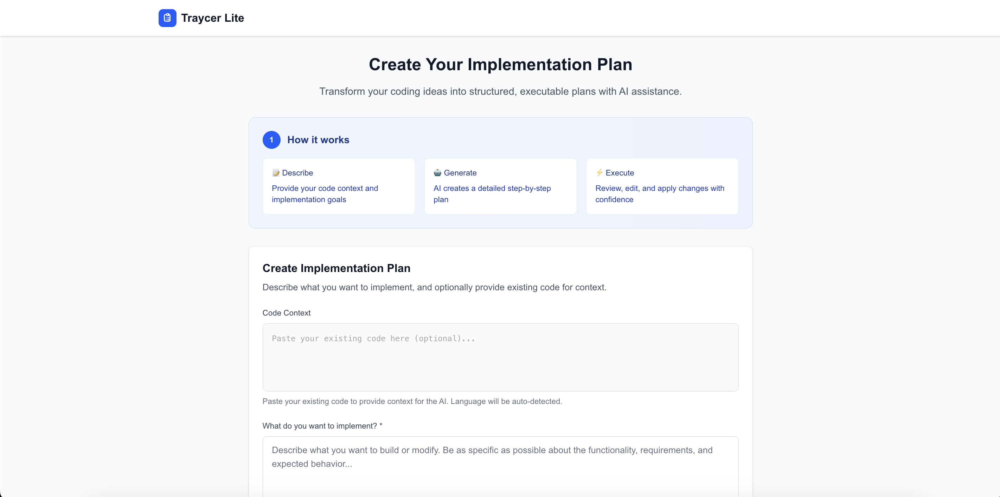

# Traycer Lite - AI Coding Agent Planner

> **Transform high-level coding ideas into actionable, step-by-step implementation plans**



🌐 **[Try it live at traycer-lite.vercel.app](https://traycer-lite.vercel.app/)**

Traycer Lite is an intelligent web application that bridges the gap between conceptual coding tasks and executable implementation. Powered by AI, it generates structured plans, allows interactive editing, and produces reviewable code changes with diffs.


## ✨ Features

### 🎯 **Intelligent Plan Generation**
- Convert natural language intent into structured implementation plans
- Support for any programming language and framework
- Context-aware suggestions based on existing code

### ✏️ **Interactive Plan Editing** 
- Drag-and-drop step reordering
- Inline editing of titles and descriptions
- Real-time plan customization and refinement

### ⚡ **Step-by-Step Execution**
- Execute individual plan steps with AI assistance
- Generate unified diffs and code patches
- Review changes before applying them

### 🔍 **Advanced Code Review**
- Syntax-highlighted diff viewer
- Accept, copy, or regenerate individual changes
- Export combined patches for external application

### 📁 **Complete File Reconstruction**
- Generate ready-to-use corrected files from patches
- Smart file parsing supports multiple file formats
- One-click copy/download of complete working code
- Before/after comparison view for transparency

### ⌨️ **Productivity Features**
- Keyboard shortcuts for power users
- Responsive design for all screen sizes
- Dark mode support with proper contrast
- Comprehensive error handling and recovery

## 🚀 Quick Start

### Prerequisites

- **Node.js** 18+ and npm
- **Groq API Key** ([Get yours here](https://console.groq.com))

### Installation

1. **Clone the repository**
   ```bash
   git clone https://github.com/shay-ff/code-planner.git
   cd code-planner
   ```

2. **Install dependencies**
   ```bash
   npm install
   ```

3. **Set up environment variables**
   ```bash
   cp .env.example .env.local
   ```
   
   Edit `.env.local` with your Groq API credentials:
   ```bash
   GROQ_API_KEY=your_groq_api_key_here
   GROQ_MODEL=llama-3.3-70b-versatile
   GROQ_MAX_TOKENS=4096
   GROQ_TEMPERATURE=0.1
   ```

4. **Start the development server**
   ```bash
   npm run dev
   ```

5. **Open your browser**
   
   Navigate to [http://localhost:3000](http://localhost:3000)

## 🎮 How to Use

### 1. Create Your Plan
- **Describe your intent**: What do you want to build or modify?
- **Add code context** (optional): Provide existing code for reference
- **Generate plan**: Click "Generate Plan" or press `Ctrl+Enter`

### 2. Customize Your Plan
- **Edit steps**: Click on titles or descriptions to modify them
- **Reorder steps**: Drag and drop to change the sequence
- **Add/remove steps**: Customize the implementation approach

### 3. Execute and Review
- **Run steps**: Execute individual steps or use `Ctrl+Enter`
- **Review diffs**: Examine generated code changes with syntax highlighting
- **Accept changes**: Accept patches you're satisfied with
- **Export patches**: Download combined changes as `.patch` files

## 💡 How It Works

### 1. **Input Your Code Context**
Paste your existing code (single or multiple files) with optional filename headers:
```python
# DataProcessor.py
class DataProcessor:
    def load_data(file_path):  # Missing 'self' parameter
        with open(file_path)   # Missing colon
            return json.load(file)
```

### 2. **Describe Your Intent**
Tell Traycer what you want to achieve:
> "Fix syntax errors and add error handling to make this code production-ready"

### 3. **Review the Generated Plan**
Get a structured, step-by-step implementation plan:
- ✅ Fix missing 'self' parameter in load_data method
- ✅ Add missing colon after 'with open' statement  
- ✅ Import required modules (json)
- ✅ Add try-catch error handling
- ✅ Add input validation

### 4. **Execute and Review Changes**
- Execute steps individually or in sequence
- Review unified diffs with syntax highlighting
- Accept, regenerate, or modify suggested changes
- See before/after comparisons

### 5. **Get Ready-to-Use Files**
- Download complete, corrected files instantly
- Copy working code to clipboard with one click
- Export traditional patches for version control
- View detailed change statistics

## 🏗️ Architecture

```
┌─────────────────┐    ┌──────────────┐    ┌─────────────────┐
│   React UI      │────│  Next.js API │────│   Groq LLM      │
│   Components    │    │   Routes     │    │   Integration   │
└─────────────────┘    └──────────────┘    └─────────────────┘
         │                       │                    │
         ▼                       ▼                    ▼
┌─────────────────┐    ┌──────────────┐    ┌─────────────────┐
│ Plan Management │    │ Prompt       │    │ Response        │
│ & State         │    │ Generation   │    │ Parsing         │
└─────────────────┘    └──────────────┘    └─────────────────┘
```

**Key Components:**
- **Frontend**: React 19 + TypeScript + Tailwind CSS
- **Backend**: Next.js 15 API routes with App Router
- **AI Provider**: Groq API with Llama 3.3 70B model
- **State Management**: React hooks with localStorage persistence

## 🛠️ Development

### Project Structure

```
src/
├── app/                    # Next.js App Router pages and API routes
│   ├── api/               
│   │   ├── generate-plan/  # Plan generation endpoint
│   │   └── execute-step/   # Step execution endpoint
│   ├── globals.css        # Global styles
│   ├── layout.tsx         # Root layout
│   └── page.tsx           # Home page
├── components/             # React components
│   ├── CodeContextInput.tsx
│   ├── DiffViewer.tsx
│   ├── ExportPanel.tsx    # Export with patches and ready files
│   ├── IntentForm.tsx
│   ├── PlanEditor.tsx
│   ├── ReadyFilesPanel.tsx # Complete file reconstruction UI
│   ├── StepCard.tsx
│   └── ...
├── hooks/                  # Custom React hooks
├── types/                  # TypeScript type definitions
└── utils/                  # Utility functions
    ├── api.ts             # API client functions
    ├── config.ts          # Environment configuration
    ├── fileReconstruction.ts # File parsing and patch application
    ├── parsers.ts         # Enhanced LLM response parsing
    └── prompts.ts         # Prompt generation
```

### Available Scripts

```bash
npm run dev      # Start development server
npm run build    # Build for production
npm run start    # Start production server
npm run lint     # Run ESLint
```

## 🚀 Deployment

### Deploy to Vercel (Recommended)

1. **Push your code to GitHub**
   ```bash
   git add .
   git commit -m "Initial commit"
   git push origin main
   ```

2. **Deploy to Vercel**
   - Visit [vercel.com](https://vercel.com) and sign in with GitHub
   - Import your repository
   - Add environment variables in Vercel dashboard:
     - `GROQ_API_KEY`
     - `GROQ_MODEL`
     - `GROQ_MAX_TOKENS`
     - `GROQ_TEMPERATURE`
   - Deploy!

### Other Deployment Options

- **Netlify**: Connect GitHub repo and add environment variables
- **Railway**: One-click deploy with environment setup
- **Self-hosted**: Run `npm run build && npm start` on your server

**Note**: Ensure your environment variables are properly configured in your deployment platform.

### API Endpoints

#### `POST /api/generate-plan`
Generate implementation plan from code context and intent.

**Request:**
```json
{
  "codeContext": "string (optional)",
  "intent": "string (required)"
}
```

**Response:**
```json
{
  "task": "string",
  "language": "string",
  "file": "string", 
  "steps": [
    {
      "id": "string",
      "title": "string",
      "description": "string",
      "input_files": ["string"],
      "output": {
        "type": "patch|instruction|file_replace",
        "patch_format": "unified_diff"
      }
    }
  ]
}
```

#### `POST /api/execute-step`
Execute individual step and generate code changes.

**Request:**
```json
{
  "step": {
    "id": "string",
    "title": "string", 
    "description": "string",
    "input_files": ["string"]
  },
  "codeContext": "string"
}
```

**Response:**
```json
{
  "step_id": "string",
  "suggested_patch": {
    "format": "unified_diff|full_file",
    "diff": "string"
  },
  "explanation": "string"
}
```

## ⌨️ Keyboard Shortcuts

| Shortcut | Action |
|----------|--------|
| `Ctrl+Enter` | Submit form / Execute focused step |
| `Enter` | Save when editing step title/description |
| `Escape` | Cancel editing |
| `Tab` | Navigate between step cards |

## 📚 Documentation

- **[Requirements](./docs/requirements.md)**: Detailed feature requirements and acceptance criteria
- **[Design Document](./docs/design.md)**: Architecture, component design, and technical specifications

## 🤝 Contributing

Contributions are welcome! Please feel free to submit a Pull Request.

1. Fork the repository
2. Create your feature branch (`git checkout -b feature/amazing-feature`)
3. Commit your changes (`git commit -m 'Add some amazing feature'`)
4. Push to the branch (`git push origin feature/amazing-feature`)
5. Open a Pull Request

## 📄 License

This project is licensed under the MIT License - see the [LICENSE](LICENSE) file for details.

## 🙏 Acknowledgments

- **[Groq](https://groq.com/)** for providing fast LLM inference
- **[Next.js](https://nextjs.org/)** for the excellent React framework
- **[Tailwind CSS](https://tailwindcss.com/)** for utility-first styling

---

<div align="center">

**Built with ❤️ using Next.js 15, TypeScript, and AI**

[Live Demo](https://traycer-lite.vercel.app/) • [Documentation](./docs/) • [GitHub](https://github.com/shay-ff/code-planner)

</div>